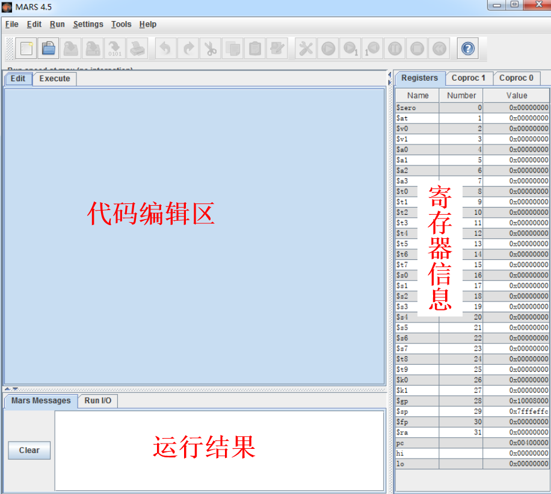
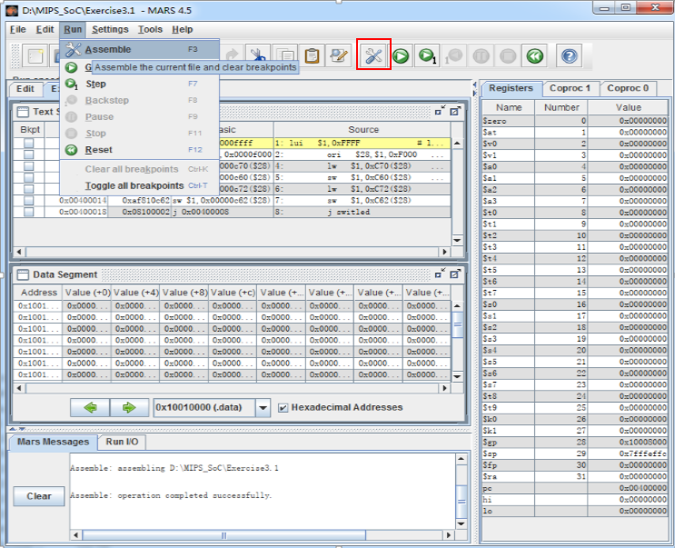
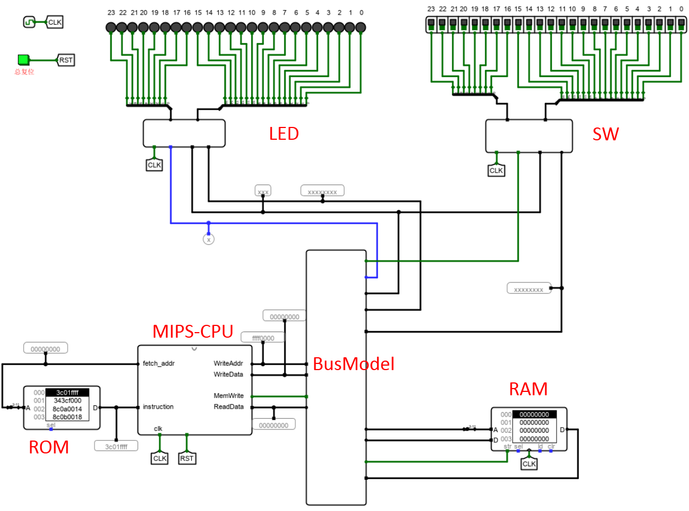
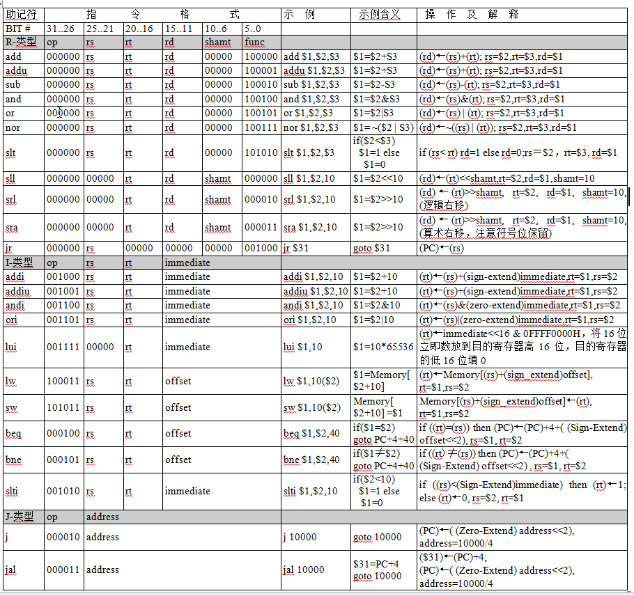
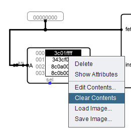

### 三、实验步骤

#### 1、 MIPS程序汇编与MARS模拟器

MIPS程序汇编MARS（MIPS汇编程序和运行时模拟器）是一个轻量级的交互式开发环境（IDE），用于使用MIPS汇编语言进行编程。具有代码提示，模拟运行，调试，统计等功能。

打开或新建文件，输入汇编指令，点击RUN->Assemble汇编成机器码，可以看到汇编之后的代码段和数据段的数据分布，可单步执行查看寄存器和数据段的数据变化。

MARS模拟器只能看到CPU执行过程中指令跳转、数据段、寄存器数据的变换，不够直观，结合logisim可以模拟查看指令的执行效果，需要将代码和数据导出加载到logisim中的主存储。
程序汇编后可以利用File菜单中的Dump Memory功能将代码段和数据段导出，采用十六进制文本的方式导出到 “**.hex”，即可在LOGISIM中加载到RAM或ROM中.

导出格式选择十六进制，数据段和代码段分开导出，.TEXT是存储在指令存储器中，.DATA 生成的数据是存储在数据存储器中,导出的文件可以用文本编辑器查看具体内容。

#### 2、 Logisim程序运行

##### MIPS_CPU SOC电路

在logisim中打开“MIPS-SoC.circ”。图为MIPS单周期CPU、指令存储器、数据存储器及外设构成的SOC电路。

支持23条指令，如图所示：

采用I/O统一编制的方式，将32位地址的存储空间分区，其中高1024个字节用来做I/O。

##### 外设地址空间

|    接口部件    |   首地址   |
| :------------: | :--------: |
|   低16位LED    | 0XFFFFFC60 |
|    高8位LED    | 0XFFFFFC62 |
| 低16位拨码开关 | 0XFFFFFC70 |
| 高8位拨码开关  | 0XFFFFFC72 |

#### 3、程序测试

在logisim中打开MIPS-SoC.circ，在指令存储器和数据存储器上点击右键，选择“清空内容”，然后再选择“编辑内容”。 把“**.hex”文件的内容粘贴到编辑器中，
即：将测试程序的汇编完成的指令存放到指令存储器中。

使用ctrl + k：时钟连续，ctrl + t：时钟单步，可以看到程序执行情况。“电路仿真->时钟连续”同“电路仿真->时钟连续”选项。

