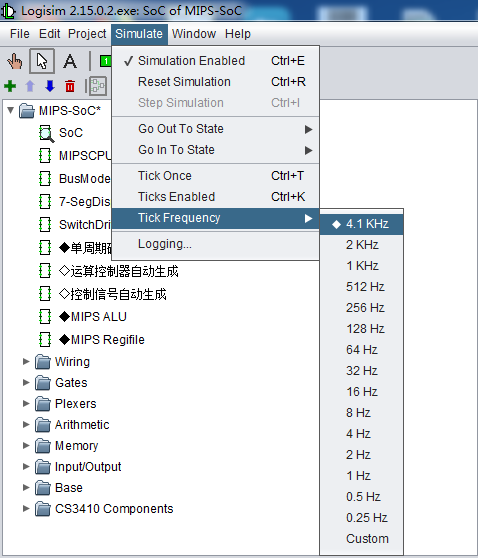

### 二、实验内容

#### 实验一： 输入输出实验

LED和拨码开关的端口地址如下：

|    接口部件    |   首地址   |
| :------------: | :--------: |
|   低16位LED    | 0XFFFFFC60 |
|    高8位LED    | 0XFFFFFC62 |
| 低16位拨码开关 | 0XFFFFFC70 |
| 高8位拨码开关  | 0XFFFFFC72 |

实现功能：不断地从拨码开关读出数据，并将数据输出到对应的LED灯上。拨码开关为1时LED灯亮。
根据实验指导书，运行程序，熟悉实验过程。程序见Exercise3.1.asm。

#### 实验二： 乘法运算

以原码一位乘为基础，设计一个数的平方和立方2种运算。由拨码开关SW3-SW0输入一个数，SW22为平方，SW23为立方，均为高电平有效。结果输出到YLD15~YLD0同时保存到存储器中。
一次运算结束后使用SW21清零（高电平有效），等待进行下一次运算。

#### 实验三： 节日彩灯

设计一个有24个发光二极管的彩灯程序。循环执行，每隔大约半秒变换一次LED灯。可设置如下变换模式：

```angular2
模式1：LED灯从两边向中间依次点亮，再从中间向两边依次熄灭。
模式2：从左向右依次亮1、2、3…24盏LED灯，至24盏LED灯全亮后，从左向右灭1、2、3…24盏LED灯，至所有灯全灭。
模式3：由拨码开关控制LED灯点亮连续X位（X由拨码开关输入），并循环右移。
```

Logisim时钟频率设置为4.1KHz

