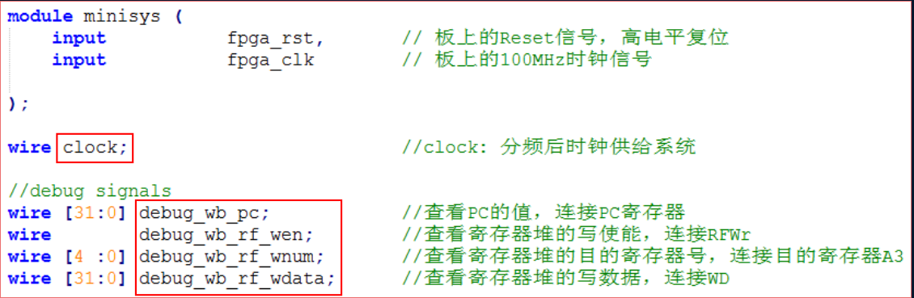
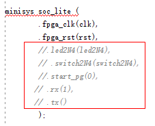
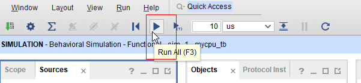
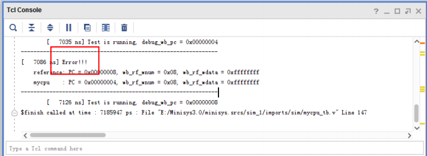

# 单周期CPU功能测试

本实验使用test_bench进行测试，相关文件见“单周期测试包”，所含文件如图，func目录下文件的作用可以查看"单周期测试包/func/Readme_firs.txt"。

测试文件参考龙芯杯竞赛提供的测试方法，单周期、多周期、流水等都可以使用，测试的原理是检测PC、寄存器写使能、写入寄存器号、写入寄存器的数据，这四者是否对应。
所以需要正确引出debug_wb_pc、debug_wb_rf_wen、debug_wb_rf_wnum、debug_wb_rf_wdata这四根信号，才能使用该测试文件。同时，顶层文件中的CPU时钟命名为clock。

## 添加debug信号
为支持指定tb，需要在顶层模块中共加入4个debug信号，具体信号如图所示，各信号功能参见对应注释。

## 更新指令存储器中的程序
运行simulation需要把提供的测试程序代码存入指令存储器中。如下图所示，将所给的"单周期测试包/inst_ram.coe"作为初始化文件加载到rom IP核。

## 添加测试相关文件
添加全局的仿真文件mycpu_tb.v，方式同添加模块仿真文件，即右键"add sources"添加，内容参考所给的tb文件。 注意信号名是否与自己所写的模块是否一致，如不一致可以修改tb。
另外所给mycpu_tb.v文件里的led2N4等信号在上板时才用到的，这里需要注释掉，即屏蔽tb文件中的下列信号

因mycpu_tb.v会从"golden_trace.txt"读取数据，需手动将该文件放在项目xx\minisys.sim\sim_1\behav\xsim目录下。

## Run Simulation

右键mycpu_tb.v进行"set as top"设置，执行"Run Simulation"，运行结束后会看到对应的波形，在tcl console窗口往上拉也可以看到是否通过的日志。

执行"RUN ALL"可以看到tcl控制台的日志输出

如果显示PASS则为通过

## 根据提示查找错误
如果不通过则结合日志信息和波形进行分析

波形分析时注意看pc地址变化时的值

inst_ram.coe机器码对应的汇编代码是"单周期测试包/func/obj/test.s"，可以根据PC值查看制定的代码。 

