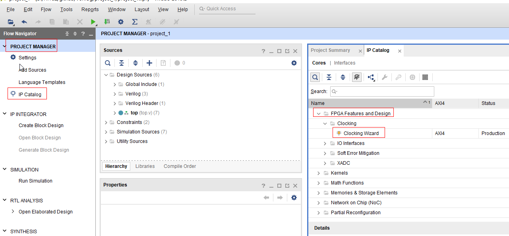

# Minisys 时钟的设计

Minisys 实验板是一个以 Xilinx Artix-7TM系列 FPGA（XC7A100T FGG484C-1）为主芯片的实验平台，所以在vivado创建项目时，选择的芯片是XC7A100T FGG484-1。

Minisys 单周期 CPU 内部需要提供系统时钟信号来控制指令执行的时序。CPU 的执行速度与时钟频率成正比，即时钟频率越高，CPU 的执行速度越快。但是由于 CPU 内部部件
会有一定的物理延迟，如果时钟频率过高，这些部件来不及响应，从而产生不稳定的输出结果。本课程设计所使用的 Minisys 实验板平台的时钟源信号的频率是 100MHz，这对 Minisys  CPU 来说太快了，所以本书采用 Xilinx 公司提供的 PPL 时钟 IP 核对该时钟信号进行分频，达到能使 Minisys  CPU 稳定工作的时钟信号。这里，将 100MHz 的时钟降为 23MHz。


## 时钟IP核使用
在vivado中打开 IP Catalog 对话框，按图所示展开 IP Catalog->FPGA Features and Design->Clocking，并双击 Clocking Wizard。



此时会打开 Clocking Wizard 对话框。在 Clocking Wizard 对话框中，按照图所示，设置 PLL 时钟，名称为 cpuclk。


点击旁边 Output Clocks 选项页，将输出频率定为 23MHz，并去掉 Reset 和Locked 前的勾即去掉reset和locked输入，最后点击 OK。系统会提问是否生成输出产品，选择“Generate”，此时可以在目录下生成cpuclk.xci模块。


## 时钟模块仿真
新建cpuclk_sim.v文件进行时钟仿真，示例代码如下，将cpuclk_sim 文件设置为顶层文件，右键点击cpuclk_sim.v，在弹出的菜单中选择 Set as Top。

```angular2
`timescale 1ns / 1ps
module cpuclk_sim( );
    // INPUT
    reg pclk = 0;
    //output
    wire clock;
    cpuclk UCLK(
        .clk_in1(pclk), 
        .clk_out1(clock)
    );
    always #5 pclk = ~pclk;
endmodule

```
