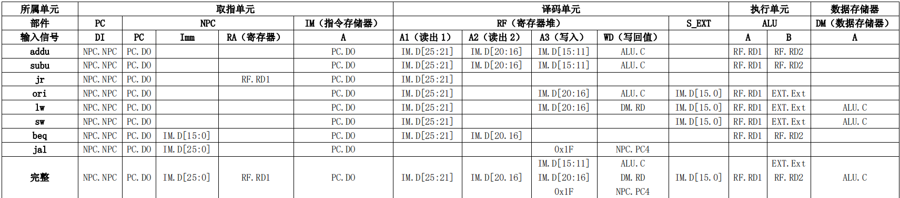
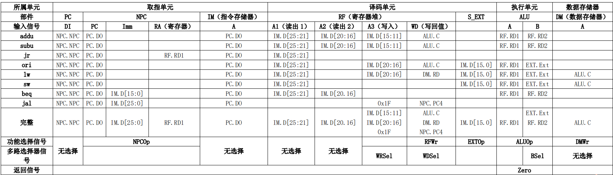
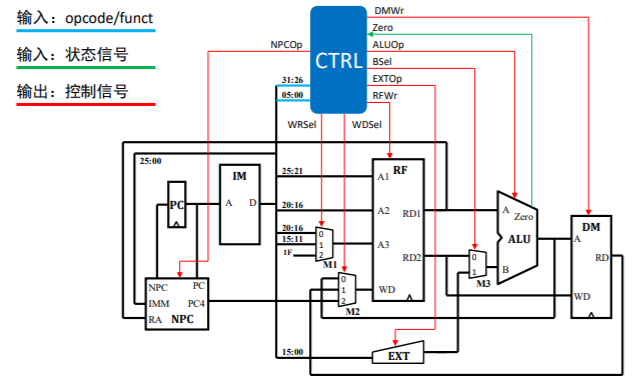

# 实验二 单周期CPU设计

## 一、实验目的
1 理解单周期CPU工作过程  
2 理解指令存储器和数据存储器的哈佛结构存储  
3 熟悉MIPS指令集  
4 掌握单周期CPU设计与实现方法  

## 二、实验题目
在Minisys实验板（XC7A100T FGG484C-1 FPGA芯片）上实现MIPS指令集的单周期CPU。如下表，24条必做、7条选做。

## 三、实验原理
### 3.1 指令详解  
  见“指令详解”部分。
  
### 3.2 数据通路设计
#### 3.2.1 数据通路的主要功能部件  
1） 指令存储器（Instruction Memory,IM）    
   读数据：输入地址，输出数据（即指令）  

2） 数据存储器（Data Memory,DM）   
   读数据：输入地址、输出数据  
   写数据：输入地址&数据  

3） 寄存器堆（Register File,RF）  
   读寄存器：输入2个读寄存器编号，输出2个32位值  
   写寄存器：输入写寄存器编号&32位值  

4）PC  

5）NPC（NextPC，NPC）  
计算下一个PC值：输入PC，输入Imm，输出计算结果）  

6）ALU（Arithmetic and Logic Unit，ALU）  
算数、逻辑、移位运算：输入2个操作数，输出计算结果

数据通路主要部件

#### 3.2.2 建模指令的数据通路
根据每条指令的描述及其指令格式，推演出指令执行过程包括的功能部件及其输入输出信号之间的连接关系，即指令级数据通路。
在推演的过程中，还将分析功能部件需要执行的具体功能，并据此再推演相应的控制信号取值。

在建模过程中，可能会面临基本功能部件不满足需求的问题，因此需要修改并完善已有基础功能部件，或者设计新的功能部件。
我们采用构建数据通路表的方式来描述数据通路，下图为8条指令构建的数据通路表示例。

在数据通路表中，有些功能部件的输入信号具有2个以上的输入源，如RF的A3端口有3个输入来源。根据数字电路知识可知，
需要部署一个MUX来实现上述需求。综合数据通路表，添加需要的MUX，或者采用其他方式处理多输入源的问题，如添加输入端口。综合数据通路表，构建数据通路结构图。

### 3.3 控制器设计
控制器的职责是根据指令的opcode和funct域计算每条指令在执行时控制信号取指。指令的控制信号包括根据指令控制部件完成不同功能的信号、部件的使能和多路选择器的选择控制，
同时，还包括与控制相关的返回信号。我们可以由数据通路表中的部件及输入、输出情况推导出控制信号，如下图示例。

接下来把控制信号添加到之前的数据通路结构图中，形成完整的数据通路结构图，如下

接下来，我们要确定控制信号的取值。根据上图，结合数据通路表及指令功能填写控制信号的取值表。

### 3.4 时钟设计

见“时钟设计”部分。

### 3.5 存储器设计

#### 3.5.1 指令ROM设计

见“存储器设计”部分。

#### 3.5.2 数据RAM设计

见“存储器设计”部分。

## 四、实验步骤
1、根据给出的数据通路表示例，完成数据通路表，画出数据通路图。 

2、根据给出的控制信号表示例，完成控制信号表，在数据通路图上添加控制信号，完成单周期CPU设计结构图。 

3、划分模块，使用Verilog语言描述实现各模块。  （芯片型号：xc7a100tfgg484-1）

4、编写仿真程序，测试设计正确性，至少完成2个模块的仿真程序，代码和截图加入实验报告。  

5、设计优化。