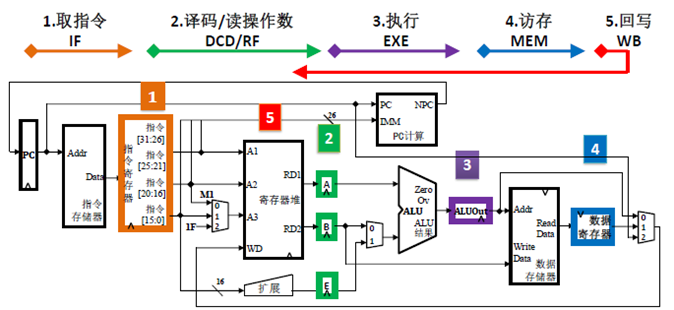
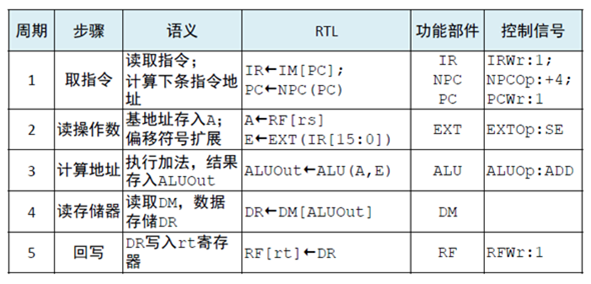
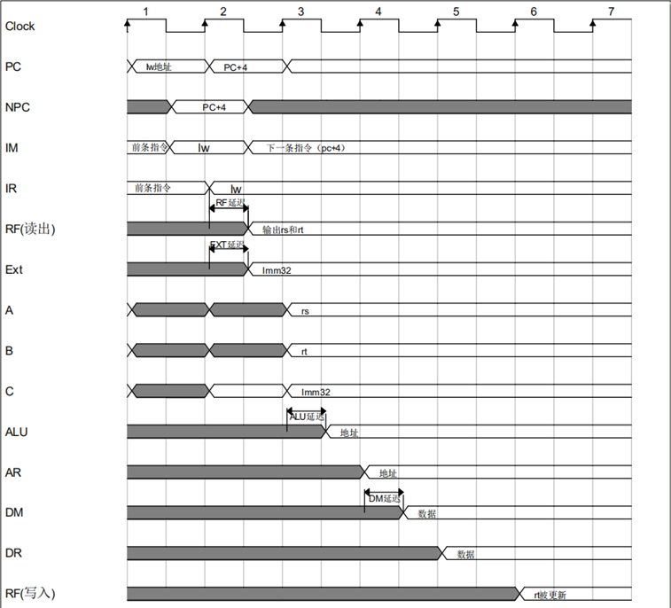
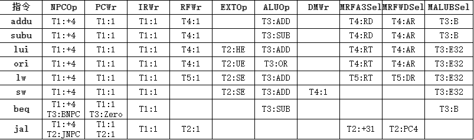

# 多周期CPU设计与实现
## 一、实验目的

1） 理解多周期CPU工作过程；  
2） 理解指令存储器和数据存储器的哈佛结构存储；  
3） 熟悉MIPS指令集；  
4） 掌握多周期CPU设计与实现方法。  

## 二、实验内容
在单周期CPU的基础上，实现多周期CPU。

## 三、实验原理

### 3.1 数据通路 

阶段划分：将指令执行过程划分成若干个阶段，通常划分为取指令、译码/读操作数、执行、访存、回写5个阶段，每个阶段的时长为一个时钟周期。
由于各个阶段的时间延迟显然比整个CPU操作的时钟延迟短，从而能够有效缩短时钟周期，提高时钟频率。

添加寄存器：每个阶段的操作结果必须保持稳定，保持结果稳定的方法是将结果保存到时序部件（如寄存器、存储器）中。

新增寄存器功能：

数据通路表（示例）：

### 3.2 控制器

lw指令的执行过程：

lw指令执行时序：

多周期控制信号说明：  
PC、IR、RF、DM需要写使能，对应信号分别是PCWr/IRWr/RFWr/DMWr。
A/B/E、ALUOut、DR不需要写使能。

控制信号取值矩阵（示例）：

## 四、实验步骤
1、建模多周期数据通路，添加寄存器，完成数据通路表。

2、逐条指令分析各阶段执行的功能，建模多周期控制器，完成控制信号取值表。

3、使用状态机描述一个指令周期中不同阶段的转换。并根据当前译码结果产生控制信号。

4、在单周期的代码基础上实现多周期CPU设计。
